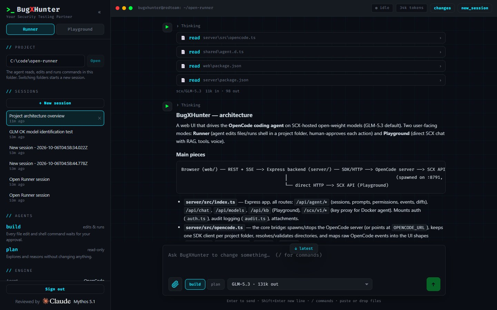
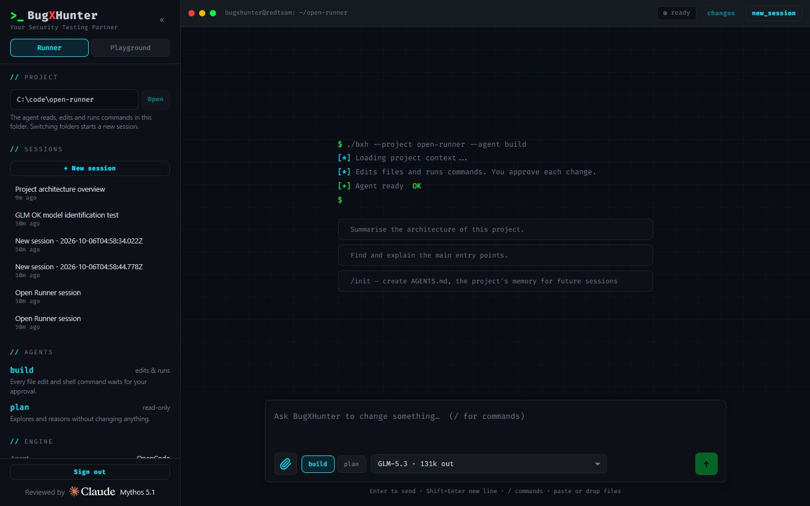
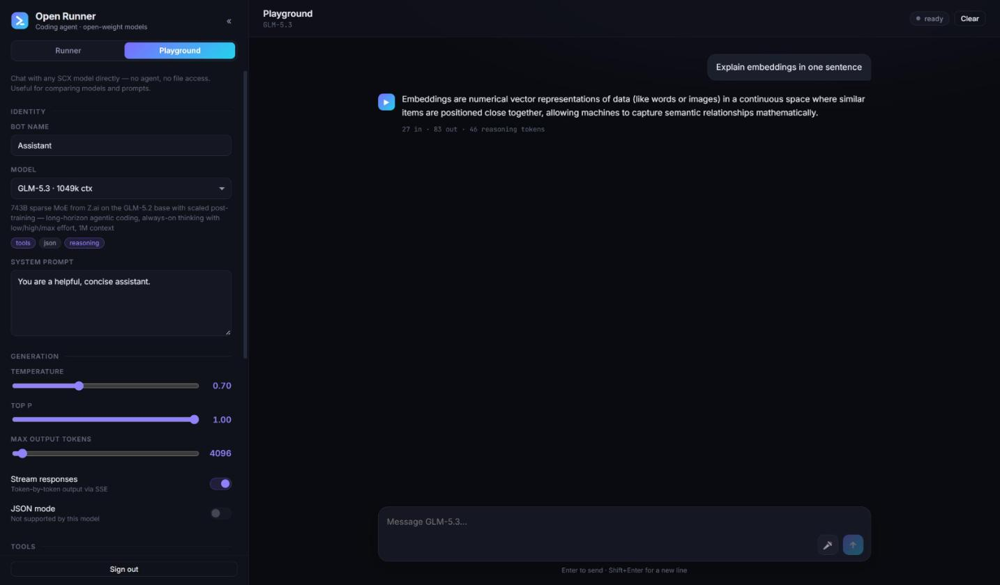

# BugXHunter

[](https://github.com/cintelis/bugxhunter-runner/actions/workflows/ci.yml)
[](https://github.com/cintelis/bugxhunter-runner/actions/workflows/codeql.yml)
[](https://claude.com/claude-code)
[](https://www.anthropic.com/claude/mythos)

The [BugXHunter](https://bugxhunter.com) security-testing agent runner: a web UI for the
[OpenCode](https://opencode.ai) coding agent, running on open-weight models (GLM-5.3 by default)
through [SCX.ai](https://platform.scx.ai). The UI follows bugxhunter.com's design system — a
macOS-style terminal window, the red-team palette (GitHub-dark surfaces with red, amber, cyan and
green accents) and Fira Code throughout. Started from the `sovgov-poc` chatbot designer.

- **Runner** — point it at a project folder and drive OpenCode's `build` (edits + shell) or
  `plan` (read-only) agent. Every file edit and shell command waits for your approval.
  Markdown replies, collapsible tool calls and reasoning, per-turn token counts, and a
  **Changes** view of what the agent edited (git repos only — OpenCode tracks changes via git).
- **Playground** — chat with any SCX model directly (no agent), with tool-calling, JSON mode,
  an embeddings-backed knowledge base and browser voice.

## Screenshots

The agent working in a project — live tool calls, reasoning, and a markdown summary:



Point it at any folder; resume past sessions; approve edits and commands as they happen:



Playground — compare SCX models directly with full generation controls:



## Requirements

- Node 22+
- OpenCode installed and on `PATH`: `npm i -g opencode-ai`
- The SCX provider set up in `~/.config/opencode/opencode.jsonc` and its key stored with
  `opencode auth login` (choose **Other**, provider id `scx`). In local mode OpenCode uses that
  key itself; BugXHunter's own calls take the key from the [vault](#key-vault) once you set one
  up, else from the same `auth.json` or `SCX_API` in a `.env` here.

## Run

```bash
npm install
npm run dev          # backend :8790 + web :5190
```

Open **http://localhost:5190**.

The backend starts its own OpenCode server on `127.0.0.1:8791` (it stops a stale one left on
that port by a previous run). Everything listens on localhost only — there is no login, so
don't expose these ports.

Set `OPEN_RUNNER_PASSWORD` (or let `docker/setup.ps1` write it to `.env`) to require a login
locally too.

## Docker (sandboxed agent + login)

```powershell
powershell -File docker/setup.ps1     # once: writes .env — login password and secrets
docker compose up -d --build          # build locally, or `docker compose pull && docker compose up -d`
                                      # for the published images (set BXH_VERSION in .env to pin a signed release)
```

Open **http://localhost:8790**, sign in with `OPEN_RUNNER_PASSWORD` from `.env`, then set up the
[vault](#key-vault) in the sidebar and put your SCX key in it. (`setup.ps1 -CopyScxKey` copies
the key into `.env` instead, in the clear.)

Two containers:

| Container | Holds | Network |
|---|---|---|
| `runner` | Web UI, login, SCX key, `/scx/v1` key proxy | shared bridge, published on 127.0.0.1 |
| `agent` | OpenCode, the agent's shell + scan tools, `/workspace` volume | shared bridge — **direct internet** |

- The agent's model calls go to `runner`'s proxy with a proxy token; the proxy swaps in the real
  key and only allows `/chat/completions` and `/models`. **The SCX key never enters the agent
  container** — this holds even though the agent has direct internet.
- Projects live in the `workspace` Docker volume (`/workspace`, a git repo so Changes work). No
  host folders are mounted. Copy a repo in as a snapshot, and results back out:

  ```powershell
  powershell -File docker/copy-in.ps1 C:\code\my-repo          # -> /workspace/my-repo (skips node_modules, .env, …)
  powershell -File docker/copy-out.ps1 my-repo C:\temp\my-repo-out
  ```

  (Plain `docker compose cp` also copies in, but leaves files owned by root, so the agent can't edit them.)
- **The agent has direct internet** so scan tools run at full speed (`nmap`/`ping`/raw DNS work
  via `NET_RAW`). Outbound connections are logged, not restricted — **only point the agent at targets you are authorised to test, and run this on a
  trusted machine/VM.**
- Both containers run as non-root with `no-new-privileges`; the agent drops all capabilities except
  `NET_RAW` and is limited to 2 CPUs, 4 GB RAM, 512 processes. Shell commands and file edits are
  approved in the UI — that, plus the container/VM boundary and the isolated SCX key, is what
  contains the agent.
- **Logs** (the audit log of prompts, tool calls and approvals, plus the egress log of hosts the
  agent connected to) live in the `logs` volume, which the agent container can't see. Read them with
  `docker compose cp runner:/logs ./logs`.
- Port 8790 is published on localhost only. Put TLS (a reverse proxy) in front and set
  `COOKIE_SECURE=1`, `TRUST_PROXY=1` and `ALLOWED_HOSTS=<your domain>` before exposing it to anyone else.

## Key vault

The SCX key (and any other secret the agent needs) lives in a vault that is **sealed at rest**: on
disk there is only ciphertext and wrapped keys, so a copied `.env`, volume or container yields
nothing. Set it up from the sidebar after the first start; it takes a minute:

1. **Passphrase** — something you know.
2. **Passkey** — something you have: Windows Hello, Touch ID, Android, or a security key. The
   authenticator derives a secret (WebAuthn PRF) that never leaves the device. Chrome, Edge and
   Safari 18+; Firefox can't do this yet. Open the app as `http://localhost:…`, not by IP.
3. **Recovery code** — shown once, stored nowhere. Keep it offline. It opens the vault if the
   passkey is lost.

Unlocking needs **both** the passphrase and the passkey (or the recovery code alone). The
decryption key then lives only in the backend's memory, so after every restart, and after
**2 hours without activity** (`OPEN_RUNNER_VAULT_IDLE_MINUTES`), someone has to unlock it before the
agent can call a model. The crypto is symmetric only (AES-256-GCM, HKDF-SHA-256, PBKDF2-SHA-256),
which keeps it out of reach of a quantum attacker; see [SECURITY.md](SECURITY.md#the-key-vault).

While the vault is locked, model calls fail with a clear "vault is sealed" message. Without a vault
the app falls back to `SCX_API` in `.env` or OpenCode's `auth.json`, in the clear.

## Security-testing tools (authorised use only)

The agent image ships a standard pentest toolchain for **authorised** testing (your own sites,
labs, CTFs). Build with `--build-arg SECTOOLS=0` to leave them out.

- **Vuln / web:** `nuclei` (templates baked in offline), `httpx`, `katana` (SPA/JS crawler),
  `ffuf` (+ SecLists wordlists in `/opt/wordlists`), `testssl`, `curl`, `openssl`, `subfinder`
  (passive).
- **Secrets (local, no network):** `gitleaks` — scan copied-in repos and JS bundles for leaked keys.
- **Raw-socket:** `nmap`, `ping`, `traceroute`, `dig`/`host` (incl. zone transfer).

All tools run directly against targets. The agent's `AGENTS.md` tells it to confirm authorisation
before scanning and to scan only hosts you name.

**Making scans fast** (they're slow if done naively):
- **Scope nuclei templates** — the biggest lever. `-tags cve,exposure` or `-severity
  critical,high,medium` instead of all ~14k templates. Fingerprint with httpx first and target the
  detected stack.
- **Pre-filter** with katana/httpx and feed only live URLs into nuclei/ffuf.
- **Tune to the target:** `-c 50 -rl 300 -bulk-size 50 -timeout 5` on a tolerant host; *lower* on a
  CDN/WAF target, where aggression trips rate-limits and is slower.
- **Run long scans detached**, writing to `/workspace` (`-o result.txt`), and poll the file so an
  aborted turn doesn't lose progress.

To fence the agent to a specific lab/target range, add firewall rules on the Docker host or the VM
you run this in — Docker's bridge NAT doesn't restrict outbound on its own.

## Configuration (environment variables)

| Variable | Default | Purpose |
|---|---|---|
| `OPEN_RUNNER_MODEL` | `scx/GLM-5.3` | Default model for both agents |
| `OPEN_RUNNER_DIR` | this folder | Default project folder |
| `OPEN_RUNNER_AGENT_PORT` | `8791` | Port for the OpenCode server |
| `PORT` | `8790` | Backend port |
| `SCX_API` | the vault, else `opencode auth login` | SCX key in the clear; ignored once a vault exists (preferred) |
| `OPEN_RUNNER_VAULT_FILE` | `~/.config/bugxhunter/vault.json` | The sealed vault (Docker: `/data/vault.json` on the `runner-data` volume) |
| `OPEN_RUNNER_VAULT_IDLE_MINUTES` | `120` | Auto-lock after this long without a model call or API write; `0` = never |
| `OPEN_RUNNER_PASSWORD` | unset (no login) | Enables the login screen |
| `OPEN_RUNNER_PASSWORD_HASH` | unset | Same, but only the scrypt hash is stored: `node scripts/hash-password.mjs` |
| `OPEN_RUNNER_SECRET` | random per start | Signs session cookies; set it to keep sessions across restarts |
| `COOKIE_SECURE` | unset | `1` marks the session cookie `Secure` (behind TLS) |
| `TRUST_PROXY` | unset | Behind a reverse proxy: `1` (hop count), `loopback`, or a CIDR list — so the login rate limit sees real client IPs |
| `OPEN_RUNNER_LOG_DIR` | unset (off) | Folder for the JSONL audit log (Docker sets `/logs`) |
| `ALLOWED_HOSTS` | localhost only | Extra `Host` header values to accept (comma list), e.g. the domain a reverse proxy serves. Everything else gets 403, which blocks DNS-rebinding attacks |
| `OPEN_RUNNER_ALLOWED_ROOTS` | any folder | Local mode: folders the UI may open, PATH-style list (`;` on Windows, `:` elsewhere). Set it before sharing the app |
| `OPENCODE_URL` | unset (spawn locally) | Use a remote OpenCode server (Docker sets `http://agent:4096`) |
| `OPEN_RUNNER_WORKSPACE` | `/workspace` | Remote mode: projects must live under this folder |
| `SCX_PROXY_TOKEN` | unset | Enables the `/scx/v1` key proxy for the sandboxed agent |

Releases are on the [releases page](https://github.com/cintelis/bugxhunter-runner/releases).
See [SECURITY.md](SECURITY.md) to verify one by hand, or to report a vulnerability.

## Releases

Every published release, newest first. Each is signed with the Cintelis release key;
`scripts/verify-release.sh` refuses anything that isn't. A release ships an **app** archive (the
compiled server and web app, runnable with Node and no Docker), a **deploy** archive
(`docker-compose.yml` and the setup scripts, pinned to that version's images), `images.txt` (both
GHCR images by digest) and the signed `checksums.txt` that covers them all.

<!-- releases:start -->
| Release | Published | Checksums | Signature | Signature check | Build |
| --- | --- | --- | --- | --- | --- |
| [v0.1.0](https://github.com/cintelis/bugxhunter-runner/releases/tag/v0.1.0) | 2026-10-07 | [checksums.txt](https://github.com/cintelis/bugxhunter-runner/releases/download/v0.1.0/checksums.txt) | [checksums.txt.sig](https://github.com/cintelis/bugxhunter-runner/releases/download/v0.1.0/checksums.txt.sig) | ✅ release key | [workflow run](https://github.com/cintelis/bugxhunter-runner/actions/runs/37597898761) |

Signature check: `checksums.txt.sig` verified against the release key (`SHA256:RY9yd61LBZCa5WrzSkEet+1Dnt2zVu9zpMRbZMWIV+I`)
when this table was generated by `scripts/release-table.sh`. To check a download
yourself, see [SECURITY.md](SECURITY.md#verifying-a-release-yourself).
<!-- releases:end -->

To use a release, verify it first (`scripts/verify-release.sh vX.Y.Z`, see
[SECURITY.md](SECURITY.md)), then either unpack the deploy archive and run `docker compose pull
&& docker compose up -d` (its `VERSION` file pins the images), or unpack the app archive and run
`npm ci --omit=dev && NODE_ENV=production node server/dist/index.js`.

## Development

```bash
npm run check        # typecheck + lint + unit tests (what CI runs)
npm run typecheck    # tsc, both workspaces
npm run lint         # eslint (typescript-eslint + react-hooks), warnings fail
npm test             # vitest: the pure logic in server/src and web/src
npm run build        # web -> web/dist, server -> server/dist (what the Docker image ships)
```

GitHub Actions: `ci.yml` runs the checks and builds both Docker images on every push and PR,
`codeql.yml` scans for security issues weekly and on PRs, `docker-publish.yml` pushes the images to
GHCR (`ghcr.io/cintelis/bugxhunter-runner` and `bugxhunter-agent`) on `master` and on `v*` tags, and Dependabot
keeps npm, Actions and base images current.

Server and browser share one type contract in `shared/` (`agent.d.ts`, `scx.d.ts`): the server's
event mapping must produce those shapes and the client consumes them, so a change on either side
fails the other's type-check.

## Releasing

Bump `version` in `package.json`, then tag and push; the release workflow checks, builds the
archives and the versioned images with provenance attestations, and creates a **draft**. Then sign
it with the offline release key, which verifies the draft's attestations and checksums first and
publishes it:

```sh
git tag -a v1.0.0 -m "BugXHunter v1.0.0"
git push origin v1.0.0
# once the workflow finishes (10-15 minutes, the agent image is large):
scripts/sign-release.sh v1.0.0
```

On Windows, run the signing script from PowerShell through Git Bash:
`& 'C:\Program Files\Git\bin\bash.exe' scripts/sign-release.sh v1.0.0`.
It asks for the key's passphrase once. Only admins can push `v*` tags.

After publishing, the script regenerates the release table above (`scripts/release-table.sh`)
and opens a pull request for it that merges itself once CI passes.

## Layout

| Path | Role |
|---|---|
| `server/src/opencode.ts` | Starts/stops the OpenCode server, one SDK client per project folder, event mapping |
| `server/src/index.ts` | Express: `/api/agent/*` (OpenCode) and `/api/chat`, `/api/models`, `/api/kb` (SCX) |
| `server/src/scx.ts`, `rag.ts` | SCX client and in-memory knowledge base (Playground) |
| `shared/` | Type contract between server and browser |
| `scripts/` | `sign-release.sh` (maintainer, offline key), `verify-release.sh` (users), `release-table.sh`, the release public key |
| `web/src/AgentPanel.tsx` | Runner transcript, approvals and session flow; `DiffModal.tsx` and `QuestionCard.tsx` hold the Changes view and agent questions |
| `web/src/Sidebar.tsx` | Project folder picker (Runner) and model/prompt settings (Playground) |
| `web/src/styles.css`, `brand.tsx`, `Terminal.tsx` | bugxhunter.com theme tokens, the `>_ BugXHunter` wordmark, terminal title bar and typed boot sequence |

## AI assistance

BugXHunter was built with [Claude Code](https://claude.com/claude-code), and the codebase was
reviewed and hardened by [Claude Mythos 5.1](https://www.anthropic.com/claude/mythos) (bug fixes,
the security hardening, tests and CI). The app shows this with Anthropic's Claude wordmark, used
as published. It is a model credit, not an endorsement by Anthropic; the maintainers are
responsible for the code.

## License

[MIT](LICENSE) © Cintelis.

> BugXHunter ships a security-testing toolchain for **authorised** testing only (your own
> systems, labs, CTFs). You are responsible for how you use it.
